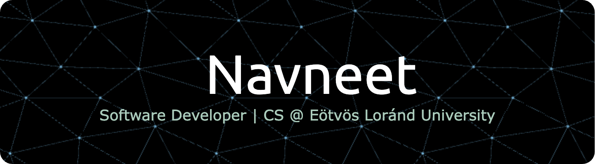

# Hey there!! 👋
  # 👨‍💻I'm Navneet Kishan Srinivasan 😃
### Computer Scientist | MSc Data Science @FAU | Ex-Quant Dev @Citi | Former Instructor @ELTE

A *Computer Science* enthusiast at **Eötvös Loránd University**, diving deep into the realms of technology. Currently, a member at **GDSC ELTE**, seeking novel challenges while fueled by curiosity-driven innovation. 🚀

## About Me </>

As a Quantitative Developer Intern at Citibank and a final-year Computer Science student at Eötvös Loránd University, Budapest, I am driven by a deep passion for technology, mathematics, and innovation. My experience spans key programming languages like Python, C#, Java, and C, along with web technologies such as HTML, CSS, JavaScript, Node.js, React.js, and other tools like MongoDB, Git, and REST APIs.

I’m a curious and proactive learner, always eager to expand my skill set and take on new challenges. My strong problem-solving, analytical, and organizational abilities enable me to excel both independently and in diverse, collaborative teams.

Fluent in English (IELTS band 8), I thrive in multicultural environments and am always open to connecting with professionals who share my enthusiasm for technology.

## Currently Learning 
  - Oracle DB
  - PLSQL
  - PHP 
  - 𝗠𝗮𝗰𝗵𝗶𝗻𝗲 𝗟𝗲𝗮𝗿𝗻𝗶𝗻𝗴 🤖
  - 𝗖𝗼𝗺𝗽𝘂𝘁𝗲𝗿 𝗩𝗶𝘀𝗶𝗼𝗻 👁️‍🗨️
  - 𝗮𝗻𝗱 𝗮𝗻𝘆𝘁𝗵𝗶𝗻𝗴 𝘁𝗵𝗮𝘁 𝗰𝗮𝘁𝗰𝗵𝗲𝘀 𝗺𝘆 𝗶𝗻𝘁𝗲𝗿𝗲𝘀𝘁 !!!🚀

## Top Skills 🚀

### Programming Languages & Tools ⌨️
- Java
- Python
- Javascript
- C#
- HTML5
- CSS
- .NET Core & .NET Framework
- PowerShell
- Shell Scripting
  
## Certifications 🎓

- [Java - Basic](https://github.com/NavneetKishanS/Certifications/blob/main/java_basic%20certificate_Navneet%20Kishan%20Srinivasan.pdf)
- [Python](https://github.com/NavneetKishanS/Certifications/blob/main/Navneet%20Kishan%20Srinivasan%20-%20Python.png)
- [Pandas](https://github.com/NavneetKishanS/Certifications/blob/main/Navneet%20Kishan%20Srinivasan%20-%20Pandas.png)
- [Intro to Machine Learning](https://github.com/NavneetKishanS/Certifications/blob/main/Navneet%20Kishan%20Srinivasan%20-%20Intro%20to%20Machine%20Learning.png)
- [C# - Basic](https://github.com/NavneetKishanS/Certifications/blob/main/C%23(basic)%20Certificate_Navneet%20Kishan%20Srinivasan.pdf)
- [SQL - Intermediate](https://github.com/NavneetKishanS/Certifications/blob/main/sql_intermediate%20certificate_Navneet%20Kishan%20Srinivasan.pdf)

## Projects 🗃️

### [JARVIS— AI Discord Bot](https://github.com/NavneetKishanS/JARVIS_DiscordBot)
- Python 3-based chatbot integrated with Discord API and OpenAI's text-davinci-003 model.

### [FraudBait— Fraud Protection System](https://github.com/NavneetKishanS/FraudBait_FraudProtectionProgram)
- Intelligent fraud detection and prevention platform using data-driven approaches.

### [WhatsApp ChatBot— AI-Powered Chatbot](https://github.com/NavneetKishanS/WhatsAppChatBot)
- Python 3-based bot leveraging OpenAI's ChatGPT model 3, AWS, Twilio, and Ngrok.

### [MapMaker - Dynamic JavaScript Game](https://navneetkishans.github.io/mapmaker/)
- Interactive game blending Javascript, HTML and CSS, where users strategically position patterns within a grid to complete missions and earn points, delivering an engaging gaming experience through DOM manipulation and a JavaScript scoring program.

### [Rock or Mine Predictor using Logistic Regression](https://github.com/NavneetKishanS/rock-or-mine-predictor)
- Implemented a machine learning model using Python, numpy, pandas, and scikit-learn with Logistic Regression to predict whether SONAR data represents a Mine or Rock. Trained on a Kaggle dataset, achieving impressive accuracy.

## Connect with Me 🌐

[ LinkedIn](https://www.linkedin.com/in/navneet-kishan-s)
&nbsp;
[ GitHub](https://github.com/NavneetKishanS)
[Google Dev Page](https://g.dev/navneetkishan)

<!-- Feel free to add more sections or customize as needed -->

<a class="badge-base__link LI-simple-link" href="https://hu.linkedin.com/in/navneet-kishan-s?trk=profile-badge">Navneet Kishan Srinivasan</a>

              
